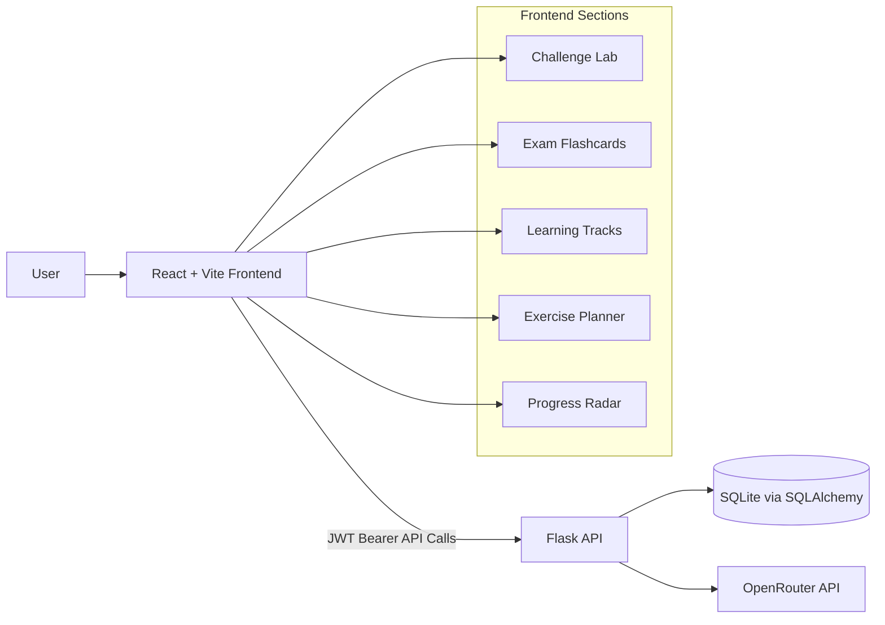
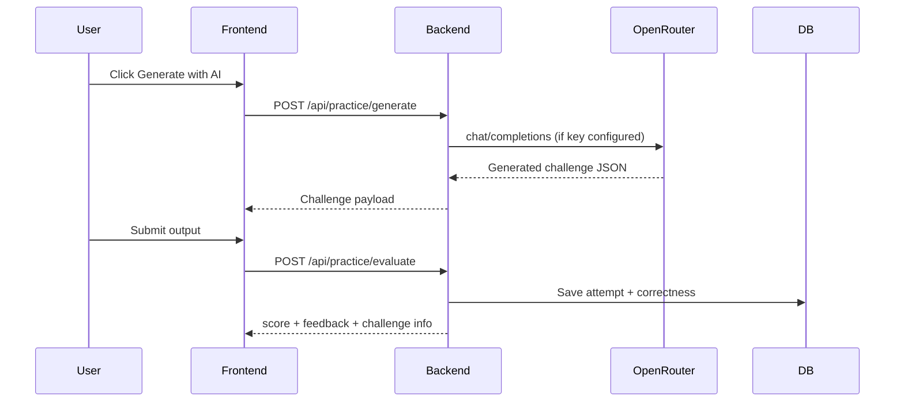

# StudyForge

StudyForge is a full-stack coding practice and study management platform designed for students preparing for technical interviews, coursework, and exams.

It combines:
- focused coding challenges
- AI-assisted challenge generation
- flashcard-based recall
- learning track organization
- exercise planning
- progress analytics

---

## Why StudyForge

Most learners split their workflow across multiple tools. StudyForge keeps everything in one place:

- **Practice** algorithm problems by topic
- **Evaluate** your output instantly
- **Generate** new challenges with OpenRouter (free model supported)
- **Review** concepts with flashcards
- **Track** progress with mastery analytics
- **Organize** your own tracks and routines

---

## Product Tour

StudyForge dashboard is organized into dedicated sections:

1. **Challenge Lab**
   - Topic filter (All Topics + core DSA topics)
   - Challenge picker
   - Problem prompt + input payload + expected output type
   - Solution editor (draft area)
   - Output evaluation with score and feedback
   - AI challenge generation button

2. **Exam Flashcards**
   - Topic-based card deck
   - Flip-card interaction for active recall
   - Next/Previous navigation

3. **Learning Tracks**
   - Track creation (name + term/phase)
   - Personal track list
   - Curated track library cards

4. **Exercise Planner**
   - Plan your task execution flow
   - Track priorities and completion states

5. **Progress Radar**
   - Completion and accuracy metrics
   - Topic mastery breakdown
   - Focus-topic filtering by mastery threshold
   - Suggested weak-topic focus

---

## Architecture Graph



---

## Request / Evaluation Flow



---

## Tech Stack

### Frontend
- React
- Vite
- TanStack React Query

### Backend
- Flask
- Flask-SQLAlchemy
- Flask-CORS
- SQLite (default local DB)
- PyJWT authentication
- python-dotenv

---

## Topic Coverage

- arrays
- linked lists
- stacks
- queues
- recursion
- sorting
- searching

---

## AI Challenge Generation

StudyForge supports dynamic challenge generation via **OpenRouter**.

- Endpoint: `POST /api/practice/generate`
- Default model: `meta-llama/llama-3.1-8b-instruct:free`
- Fallback behavior: if provider/key/network fails, StudyForge returns a valid static challenge so the workflow does not break.

---

## Project Structure

- `frontend/` — React application
  - `src/components/` UI panels (Challenge, Analytics, Courses, Tasks)
  - `src/hooks/` data hooks and API mutations/queries
  - `src/context/` auth state
- `backend/` — Flask API
  - `app/routes/` API routes
  - `app/services/` business logic
  - `app/models/` SQLAlchemy models
  - `app/algorithms/` challenge bank + algorithm utilities
  - `app/utils/` auth/error handling

---

## Local Setup

## 1) Backend

Install dependencies:

```bash
python3 -m pip install -r backend/requirements.txt
```

Create backend env file:

```bash
cp backend/.env.example backend/.env
```

Set values in `backend/.env` (minimum recommended):

- `SECRET_KEY=your_secret`
- `JWT_EXP_SECONDS=86400`
- `OPENROUTER_API_KEY=your_openrouter_key`
- `OPENROUTER_MODEL=meta-llama/llama-3.1-8b-instruct:free`

Run API server:

```bash
python3 backend/run.py
```

Health check:

- `http://127.0.0.1:5000/api/health`

## 2) Frontend

Install dependencies:

```bash
npm --prefix frontend install
```

Create frontend env file:

```bash
cp frontend/.env.example frontend/.env
```

Run dev server:

```bash
npm --prefix frontend run dev -- --host 127.0.0.1 --port 5173
```

Open app:

- `http://127.0.0.1:5173/`

---

## Build & Test

Build frontend:

```bash
npm --prefix frontend run build
```

Run backend tests:

```bash
python3 -m pytest backend/tests
```

---

## API Overview

### Auth
- `POST /api/auth/register`
- `POST /api/auth/login`

### Courses
- `GET /api/courses`
- `POST /api/courses`

### Tasks
- `GET /api/tasks`
- `POST /api/tasks`
- `PATCH /api/tasks/:task_id`

### Practice
- `GET /api/practice/challenges?topic=...`
- `POST /api/practice/generate`
- `POST /api/practice/evaluate`

### Analytics
- `GET /api/analytics/overview`
- `GET /api/analytics/topics`

---

## Security Notes

- Never commit real API keys.
- Keep secrets only in local `.env` or a secure deployment secret manager.
- JWT expiration is enforced server-side.
- Frontend handles session-expired state by clearing local auth and requiring re-login.

---

## Sharing on GitHub / Hub Profiles

If you are sharing this project publicly:

- Keep this README at the repository root
- Add screenshots/gifs of each dashboard section
- Pin this repository on your profile
- Include project highlights in the repo description:
  - full-stack Flask + React
  - AI challenge generation via OpenRouter
  - analytics + focused practice workflow

Suggested short repo description:

**“StudyForge: full-stack coding practice platform with AI-generated challenges, flashcards, planning tools, and mastery analytics.”**

---

## Status

Active and extensible. Good next upgrades:
- richer code execution sandbox for solution editor
- spaced-repetition scheduling for flashcards
- per-user custom challenge sets
- deployment profiles (Render/Fly.io/Vercel) with production env templates
